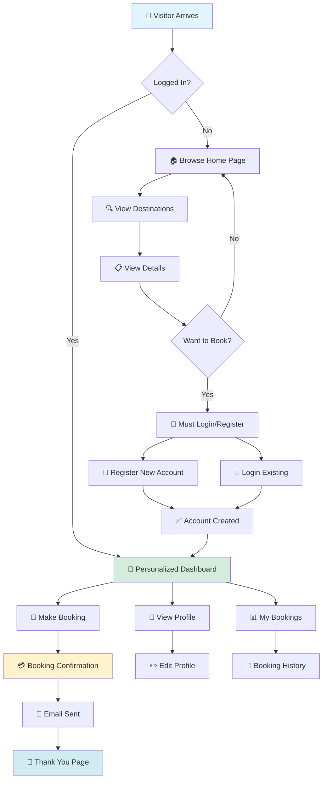

<div align="center">

# 🌍 Exploria - Tours & Travels Booking System

### *Your Gateway to Amazing Travel Adventures*

**A comprehensive travel booking web application built with ASP.NET Web Forms**  
*Explore destinations • Make bookings • Manage trips*

---

[](https://dotnet.microsoft.com/)
[](https://docs.microsoft.com/en-us/dotnet/csharp/)
[](https://www.microsoft.com/sql-server)
[](https://tailwindcss.com/)
[](https://www.javascript.com/)

[](https://github.com/Sah-Ashok/Web_Project_Tours)
[](https://dotnet.microsoft.com/)
[](LICENSE)

[🚀 Quick Start](#-quick-start) • [✨ Features](#-key-features) • [🏗️ Architecture](#️-complete-system-architecture) • [📸 Screenshots](#-project-showcase) • [⚠️ Security](#-security-notice)

</div>

---

## 📋 Table of Contents

- [Overview](#-overview)
- [Complete System Architecture](#️-complete-system-architecture)
- [Key Features](#-key-features)
- [Technology Stack](#-technology-stack)
- [Database Design](#️-database-design)
- [Project Structure](#-project-structure)
- [Quick Start](#-quick-start)
- [Project Showcase](#-project-showcase)
- [Security Notice](#-security-notice)
- [Learning Outcomes](#-learning-outcomes)
- [Contributing](#-contributing)
- [License](#-license)
- [Changelog](#-changelog)

---

## 🎯 Overview

**Exploria** is a full-featured travel booking system that demonstrates modern web development practices using ASP.NET Web Forms. This educational project showcases:

> 🔍 **Browse** amazing destinations with rich details and beautiful imagery  
> 📅 **Book** trips with flexible date selection and traveler management  
> 👤 **Manage** user profiles and track booking history  
> 🔐 **Secure** authentication with password recovery via email  
> ⚙️ **Admin** panel for complete content and user management

### 🎓 Built For Learning

This project serves as a comprehensive example of:
- Full-stack web development with ASP.NET Web Forms
- Database design and ADO.NET implementation
- Modern frontend integration (Tailwind CSS, JavaScript libraries)
- Email service integration (SMTP)
- File upload and management
- Session-based authentication
- Admin dashboard patterns

---

## 🏗️ Complete System Architecture

### 📊 High-Level System Overview

```
╔═══════════════════════════════════════════════════════════════════════════╗
║                     EXPLORIA TRAVEL BOOKING SYSTEM                        ║
║                          3-Tier Architecture                              ║
╚═══════════════════════════════════════════════════════════════════════════╝

┌───────────────────────────────────────────────────────────────────────────┐
│                          PRESENTATION LAYER                               │
│                         (ASP.NET Web Forms)                               │
├───────────────────────────────────────────────────────────────────────────┤
│                                                                           │
│  ┌─────────────────┐  ┌─────────────────┐  ┌─────────────────┐         │
│  │  PUBLIC PAGES   │  │   USER PAGES    │  │   ADMIN PAGES   │         │
│  ├─────────────────┤  ├─────────────────┤  ├─────────────────┤         │
│  │ • Home.aspx     │  │ • Profile.aspx  │  │ • AddDestination│         │
│  │ • Destination   │  │ • MyBookings    │  │ • AdminDest.    │         │
│  │ • ViewDetails   │  │ • bookingConf   │  │ • AdminUserMgmt │         │
│  │ • About.aspx    │  │                 │  │                 │         │
│  │ • Contact.aspx  │  │                 │  │                 │         │
│  │ • Login/Register│  │                 │  │                 │         │
│  └─────────────────┘  └─────────────────┘  └─────────────────┘         │
│                                                                           │
│  ┌─────────────────────────────────────────────────────────────────┐    │
│  │ MASTER PAGE: Site1.Master (Navbar, Footer, Common Layout)      │    │
│  └─────────────────────────────────────────────────────────────────┘    │
│                                                                           │
│  ┌─────────────────────────────────────────────────────────────────┐    │
│  │ STYLING: Tailwind CSS + Custom CSS (home.css, destinations.css)│    │
│  └─────────────────────────────────────────────────────────────────┘    │
│                                                                           │
│  ┌─────────────────────────────────────────────────────────────────┐    │
│  │ INTERACTIVITY: JavaScript + AOS + Swiper.js                    │    │
│  └─────────────────────────────────────────────────────────────────┘    │
└───────────────────────────────────────────────────────────────────────────┘
                                    ▼
┌───────────────────────────────────────────────────────────────────────────┐
│                         BUSINESS LOGIC LAYER                              │
│                          (C# Code-Behind)                                 │
├───────────────────────────────────────────────────────────────────────────┤
│                                                                           │
│  ┌──────────────────┐  ┌──────────────────┐  ┌──────────────────┐      │
│  │  Authentication  │  │  Booking Logic   │  │  Admin Services  │      │
│  ├──────────────────┤  ├──────────────────┤  ├──────────────────┤      │
│  │ • Login/Logout   │  │ • Price Calc.    │  │ • Dest. CRUD     │      │
│  │ • Registration   │  │ • Date Valid.    │  │ • User Mgmt      │      │
│  │ • Session Mgmt   │  │ • Traveler Info  │  │ • Content Mgmt   │      │
│  │ • Password Reset │  │ • Confirmation   │  │                  │      │
│  └──────────────────┘  └──────────────────┘  └──────────────────┘      │
│                                                                           │
│  ┌─────────────────────────────────────────────────────────────────┐    │
│  │ EMAIL SERVICE: EmailService.cs (SMTP Gmail Integration)        │    │
│  └─────────────────────────────────────────────────────────────────┘    │
│                                                                           │
│  ┌─────────────────────────────────────────────────────────────────┐    │
│  │ FILE HANDLING: Image Upload & Storage (Profile & Destinations) │    │
│  └─────────────────────────────────────────────────────────────────┘    │
└───────────────────────────────────────────────────────────────────────────┘
                                    ▼
┌───────────────────────────────────────────────────────────────────────────┐
│                          DATA ACCESS LAYER                                │
│                            (ADO.NET)                                      │
├───────────────────────────────────────────────────────────────────────────┤
│                                                                           │
│  ┌─────────────────────────────────────────────────────────────────┐    │
│  │ SqlConnection → SqlCommand → SqlDataReader/SqlDataAdapter      │    │
│  └─────────────────────────────────────────────────────────────────┘    │
│                                                                           │
│  ┌──────────────┐  ┌──────────────┐  ┌──────────────┐  ┌──────────┐   │
│  │   CREATE     │  │     READ     │  │    UPDATE    │  │  DELETE  │   │
│  │   (INSERT)   │  │   (SELECT)   │  │   (UPDATE)   │  │ (DELETE) │   │
│  └──────────────┘  └──────────────┘  └──────────────┘  └──────────┘   │
└───────────────────────────────────────────────────────────────────────────┘
                                    ▼
┌───────────────────────────────────────────────────────────────────────────┐
│                           DATABASE LAYER                                  │
│                     SQL Server LocalDB (Exploria_db)                      │
├───────────────────────────────────────────────────────────────────────────┤
│                                                                           │
│  ┌──────────────┐  ┌──────────────┐  ┌──────────────┐  ┌──────────┐   │
│  │    USERS     │  │ DESTINATIONS │  │   BOOKINGS   │  │ CONTACTS │   │
│  ├──────────────┤  ├──────────────┤  ├──────────────┤  ├──────────┤   │
│  │ • Id (PK)    │  │ • Id (PK)    │  │ • BookingId  │  │ • Id     │   │
│  │ • FirstName  │  │ • Name       │  │ • UserId FK  │  │ • Name   │   │
│  │ • LastName   │  │ • Tagline    │  │ • Dest.Id FK │  │ • Email  │   │
│  │ • Email      │  │ • Duration   │  │ • TravelDate │  │ • Subject│   │
│  │ • Password   │  │ • Price      │  │ • Travelers  │  │ • Message│   │
│  │ • Phone      │  │ • Category   │  │ • TotalAmt   │  │          │   │
│  │ • Role       │  │ • Images     │  │ • Status     │  │          │   │
│  │ • Image      │  │ • Region     │  │ • BookingDt  │  │          │   │
│  └──────────────┘  └──────────────┘  └──────────────┘  └──────────┘   │
│         │                  │                  │                          │
│         └──────────────────┴──────────────────┘                          │
│                            │                                              │
│                  Foreign Key Relationships                                │
└───────────────────────────────────────────────────────────────────────────┘
```

### 🔄 User Journey Flow



### 🔐 Authentication & Authorization Flow

```
┌─────────────────────────────────────────────────────────────────────┐
│                    AUTHENTICATION WORKFLOW                          │
└─────────────────────────────────────────────────────────────────────┘

  REGISTRATION                LOGIN               SESSION CHECK
       │                        │                        │
       ▼                        ▼                        ▼
┌─────────────┐         ┌─────────────┐         ┌─────────────┐
│ Register    │         │ Login.aspx  │         │ Page_Load   │
│ Form Submit │         │ Credentials │         │ Event       │
└──────┬──────┘         └──────┬──────┘         └──────┬──────┘
       │                       │                        │
       ▼                       ▼                        ▼
┌─────────────┐         ┌─────────────┐         ┌─────────────┐
│ Validate    │         │ Verify User │         │ Check       │
│ Input       │         │ in Database │         │ Session     │
└──────┬──────┘         └──────┬──────┘         └──────┬──────┘
       │                       │                        │
       ▼                       ▼                        ▼
┌─────────────┐         ┌─────────────┐         ┌─────────────┐
│ Insert User │         │ Create      │         │ Redirect    │
│ to Database │         │ Session:    │         │ if Invalid  │
└──────┬──────┘         │ - UserID    │         └─────────────┘
       │                │ - FullName  │
       │                │ - Email     │
       │                │ - Role      │
       ▼                │ - isLogin   │
┌─────────────┐         └──────┬──────┘
│ Upload      │                │
│ Profile Pic │                ▼
└──────┬──────┘         ┌─────────────┐
       │                │ Redirect to │
       │                │ Home Page   │
       │                └─────────────┘
       ▼
┌─────────────┐
│ Auto Login  │
│ New User    │
└─────────────┘


  AUTHORIZATION CHECK (Role-Based Access Control)
  ───────────────────────────────────────────────

    Page Request → Check Session["isLogin"]
           │
           ├─→ [NULL] → Redirect to Login.aspx
           │
           └─→ [TRUE] → Check Session["Role"]
                    │
                    ├─→ [users] → Access User Pages
                    │              - Profile.aspx
                    │              - MyBookings.aspx
                    │              - bookingConfirmation.aspx
                    │
                    └─→ [admin] → Access Admin Pages
                                   - AddDestinations.aspx
                                   - AdminDestinations.aspx
                                   - AdminUserManagement.aspx
```

### 📦 Component Architecture

```
┌─────────────────────────────────────────────────────────────────┐
│                      FRONTEND COMPONENTS                        │
├─────────────────────────────────────────────────────────────────┤
│                                                                 │
│  ┌──────────────┐  ┌──────────────┐  ┌──────────────┐        │
│  │   NAVBAR     │  │    HERO      │  │   FOOTER     │        │
│  │ (Master Page)│  │   SECTION    │  │ (Master Page)│        │
│  └──────────────┘  └──────────────┘  └──────────────┘        │
│                                                                 │
│  ┌──────────────┐  ┌──────────────┐  ┌──────────────┐        │
│  │ DESTINATION  │  │   BOOKING    │  │    PROFILE   │        │
│  │    CARDS     │  │     FORM     │  │     CARD     │        │
│  └──────────────┘  └──────────────┘  └──────────────┘        │
│                                                                 │
│  ┌──────────────┐  ┌──────────────┐  ┌──────────────┐        │
│  │   IMAGE      │  │    PRICE     │  │    STATUS    │        │
│  │   GALLERY    │  │  CALCULATOR  │  │    BADGES    │        │
│  └──────────────┘  └──────────────┘  └──────────────┘        │
│                                                                 │
└─────────────────────────────────────────────────────────────────┘

┌─────────────────────────────────────────────────────────────────┐
│                      BACKEND SERVICES                           │
├─────────────────────────────────────────────────────────────────┤
│                                                                 │
│  ┌──────────────────────────────────────────────────┐          │
│  │           EmailService.cs                        │          │
│  ├──────────────────────────────────────────────────┤          │
│  │ • SendBookingConfirmation()                      │          │
│  │ • SendPasswordResetLink()                        │          │
│  │ • SendContactNotification()                      │          │
│  └──────────────────────────────────────────────────┘          │
│                                                                 │
│  ┌──────────────────────────────────────────────────┐          │
│  │           FileUploadHandler                      │          │
│  ├──────────────────────────────────────────────────┤          │
│  │ • SaveProfileImage()                             │          │
│  │ • SaveDestinationImages()                        │          │
│  │ • ValidateImageFormat()                          │          │
│  └──────────────────────────────────────────────────┘          │
│                                                                 │
│  ┌──────────────────────────────────────────────────┐          │
│  │           SessionManager                         │          │
│  ├──────────────────────────────────────────────────┤          │
│  │ • CreateUserSession()                            │          │
│  │ • ValidateSession()                              │          │
│  │ • ClearSession()                                 │          │
│  └──────────────────────────────────────────────────┘          │
│                                                                 │
└─────────────────────────────────────────────────────────────────┘
```

---

## ✨ Key Features

<table>
<tr>
<td width="50%" valign="top">

### 👥 **User Features**

#### 🔐 Authentication System
- ✅ User registration with profile photo upload
- ✅ Secure login/logout functionality
- ✅ Password recovery via email
- ✅ Session-based access control
- ✅ Role-based authorization (User/Admin)

#### 🌴 Destination Browsing
- ✅ Browse destinations with category filters
- ✅ Beautiful card-based grid layout
- ✅ Detailed destination pages with image galleries
- ✅ View pricing, duration, and included amenities
- ✅ Responsive design for all devices

#### 📅 Booking System
- ✅ Interactive booking form with date picker
- ✅ Select number of adults and children
- ✅ Real-time price calculation
- ✅ Booking confirmation with unique ID
- ✅ Email confirmation sent automatically

#### 👤 User Dashboard
- ✅ View and edit personal profile
- ✅ Upload/change profile picture
- ✅ View complete booking history
- ✅ Track booking status (Pending, Confirmed, Cancelled)
- ✅ Update personal information

</td>
<td width="50%" valign="top">

### ⚙️ **Admin Features**

#### 📊 Admin Dashboard
- ✅ Manage all destinations (Add/Edit/Delete)
- ✅ Upload multiple destination images
- ✅ Set pricing and destination details
- ✅ Categorize destinations (Beach, Mountain, City, etc.)
- ✅ View all system bookings

#### 👥 User Management
- ✅ View all registered users
- ✅ Monitor user activity
- ✅ Access user booking history
- ✅ Manage user roles

#### 📧 Communication
- ✅ View contact form submissions
- ✅ Automated email notifications
- ✅ Booking confirmations
- ✅ Password reset emails

### 🎨 **UI/UX Features**
- ✅ Modern, responsive design with Tailwind CSS
- ✅ Smooth animations with AOS library
- ✅ Image carousels with Swiper.js
- ✅ Interactive forms with validation
- ✅ Loading states and error handling
- ✅ Mobile-first approach

</td>
</tr>
</table>

---

## 🛠 Technology Stack

### Backend Technologies

| Technology | Purpose | Version |
|------------|---------|---------|
|  **ASP.NET Web Forms** | Web Framework | .NET 4.7.2 |
|  **C#** | Programming Language | 7.3 |
|  **ADO.NET** | Data Access | Built-in |
|  **SQL Server LocalDB** | Database | 2019 |
|  **IIS Express** | Web Server | 10.0 |

### Frontend Technologies

| Technology | Purpose | Version |
|------------|---------|---------|
|  **HTML5** | Markup | Latest |
|  **CSS3** | Styling | Latest |
|  **Tailwind CSS** | CSS Framework | 3.x |
|  **JavaScript** | Interactivity | ES6+ |
|  **jQuery** | DOM Manipulation | 3.x |

### JavaScript Libraries

- **AOS (Animate On Scroll)** - Scroll animations
- **Swiper.js** - Touch-enabled image carousels
- **Font Awesome** - Icon library
- **Google Fonts** - Typography

### Additional Services

- **Gmail SMTP** - Email service integration
- **LocalDB** - Development database

---

## 🗄️ Database Design

### Entity Relationship Diagram

```
┌─────────────────────────────────────────────────────────────────────┐
│                         DATABASE SCHEMA                             │
│                      Exploria_db (SQL Server)                       │
└─────────────────────────────────────────────────────────────────────┘

┌─────────────────────┐              ┌──────────────────────┐
│      USERS          │              │    DESTINATIONS      │
├─────────────────────┤              ├──────────────────────┤
│ 🔑 Id (INT, PK)     │              │ 🔑 Id (INT, PK)      │
│ FirstName           │              │ Name                 │
│ LastName            │              │ Tagline              │
│ Email (UNIQUE)      │              │ Duration             │
│ Password            │              │ GroupSize            │
│ Phone               │              │ Region               │
│ Country             │              │ Description          │
│ State               │              │ Included             │
│ City                │              │ Price (DECIMAL)      │
│ Image               │              │ Category             │
│ Role (DEFAULT)      │              │ MainImage            │
└──────────┬──────────┘              │ Image                │
           │                         │ DateAdded (DATETIME) │
           │                         └──────────┬───────────┘
           │                                    │
           │         ┌──────────────────────────┤
           │         │                          │
           │         │                          │
           └─────────┼──────────────┐           │
                     │              │           │
                     ▼              ▼           ▼
              ┌─────────────────────────────────────┐
              │         BOOKINGS                    │
              ├─────────────────────────────────────┤
              │ 🔑 BookingId (INT, PK)              │
              │ 🔗 UserId (INT, FK)                 │
              │ 🔗 DestinationId (INT, FK)          │
              │ TravelerFirstName                   │
              │ TravelerLastName                    │
              │ TravelerEmail                       │
              │ TravelerPhone                       │
              │ TravelDate (DATE)                   │
              │ NumberOfAdults (INT)                │
              │ NumberOfChildren (INT)              │
              │ TotalAmount (DECIMAL)               │
              │ BookingStatus (VARCHAR)             │
              │ DateOfBooking (DATETIME)            │
              └─────────────────────────────────────┘

                     ┌──────────────────────┐
                     │      CONTACTS        │
                     ├──────────────────────┤
                     │ 🔑 Id (INT, PK)      │
                     │ Name                 │
                     │ Email                │
                     │ Subject              │
                     │ Message              │
                     └──────────────────────┘

  RELATIONSHIPS:
  • Users 1 ──── N Bookings (One user can have many bookings)
  • Destinations 1 ──── N Bookings (One destination can be booked many times)
```

<details>
<summary>📋 Click to view detailed table schemas</summary>

### Users Table
```sql
CREATE TABLE Users (
    Id INT PRIMARY KEY IDENTITY(1,1),
    FirstName NVARCHAR(MAX) NOT NULL,
    LastName NVARCHAR(MAX) NOT NULL,
    Email NVARCHAR(MAX) NOT NULL UNIQUE,
    Password NVARCHAR(MAX) NOT NULL,
    Phone NVARCHAR(MAX) NOT NULL,
    Country NVARCHAR(MAX) NOT NULL,
    State NVARCHAR(MAX) NOT NULL,
    City NVARCHAR(MAX) NOT NULL,
    Image NVARCHAR(MAX) NULL,
    Role NVARCHAR(MAX) DEFAULT 'users'
);
```

### Destinations Table
```sql
CREATE TABLE Destinations (
    Id INT PRIMARY KEY IDENTITY(1,1),
    Name NVARCHAR(MAX) NOT NULL,
    Tagline NVARCHAR(MAX) NULL,
    Duration NVARCHAR(MAX) NULL,
    GroupSize NVARCHAR(MAX) NULL,
    Region NVARCHAR(MAX) NULL,
    Description NVARCHAR(MAX) NOT NULL,
    Included NVARCHAR(MAX) NULL,
    Price DECIMAL(10,2) NOT NULL,
    Category NVARCHAR(MAX) NOT NULL,
    MainImage NVARCHAR(MAX) NOT NULL,
    Image NVARCHAR(MAX) NULL,
    DateAdded DATETIME DEFAULT GETDATE()
);
```

### Bookings Table
```sql
CREATE TABLE Bookings (
    BookingId INT PRIMARY KEY IDENTITY(1,1),
    UserId INT FOREIGN KEY REFERENCES Users(Id),
    DestinationId INT FOREIGN KEY REFERENCES Destinations(Id),
    TravelerFirstName NVARCHAR(MAX) NOT NULL,
    TravelerLastName NVARCHAR(MAX) NOT NULL,
    TravelerEmail NVARCHAR(MAX) NOT NULL,
    TravelerPhone NVARCHAR(MAX) NULL,
    TravelDate DATE NOT NULL,
    NumberOfAdults INT NOT NULL,
    NumberOfChildren INT DEFAULT 0,
    TotalAmount DECIMAL(10,2) NOT NULL,
    BookingStatus NVARCHAR(50) DEFAULT 'Pending'
        CHECK (BookingStatus IN ('Pending', 'Confirmed', 'Cancelled', 'Completed')),
    DateOfBooking DATETIME DEFAULT GETDATE()
);
```

### Contacts Table
```sql
CREATE TABLE Contacts (
    Id INT PRIMARY KEY IDENTITY(1,1),
    Name NVARCHAR(MAX) NOT NULL,
    Email NVARCHAR(MAX) NOT NULL,
    Subject NVARCHAR(MAX) NOT NULL,
    Message NVARCHAR(MAX) NOT NULL
);
```

</details>

---

## 📁 Project Structure

```
Tours&Travels/
│
├── 📄 Web.config                          # Application configuration
├── 📄 Site1.Master                        # Master page (layout template)
├── 📄 Site1.Master.cs                     # Master page code-behind
│
├── 🏠 PUBLIC PAGES
│   ├── Home.aspx                          # Landing page with hero section
│   ├── Destination.aspx                   # Browse all destinations
│   ├── ViewDetails.aspx                   # Single destination details
│   ├── About.aspx                         # About us page
│   └── Contact.aspx                       # Contact form
│
├── 🔐 AUTHENTICATION PAGES
│   ├── Login.aspx                         # User login
│   ├── Register.aspx                      # New user registration
│   ├── ForgetPassword.aspx                # Password recovery
│   └── ResetPassword.aspx                 # Reset password form
│
├── 👤 USER PAGES (Require Login)
│   ├── Profile.aspx                       # User profile management
│   ├── MyBookings.aspx                    # Booking history
│   ├── bookingConfirmation.aspx           # Booking form & confirmation
│   └── ThankYou.aspx                      # Booking success page
│
├── ⚙️ ADMIN PAGES (Require Admin Role)
│   ├── AddDestinations.aspx               # Add new destinations
│   ├── AdminDestinations.aspx             # Manage destinations
│   └── AdminUserManagement.aspx           # Manage users
│
├── 📧 SERVICES
│   └── EmailService.cs                    # Email notification service
│
├── 🎨 ASSETS
│   ├── CSS/
│   │   ├── home.css                       # Home page styles
│   │   ├── destinations.css               # Destination page styles
│   │   ├── modern-hero.css                # Hero section styles
│   │   ├── footer.css                     # Footer styles
│   │   └── testimonials.css               # Testimonials styles
│   │
│   ├── JS/                                # JavaScript files
│   │   └── custom scripts
│   │
│   └── Images/                            # Image assets
│       ├── destination-images/
│       ├── profile-pictures/
│       └── static-assets/
│
├── 🗄️ DATABASE
│   └── App_Data/
│       ├── Exploria_db.mdf                # Database file
│       └── Exploria_db_log.ldf            # Database log file
│
└── 📦 PACKAGES
    └── packages/                          # NuGet packages
```

---

## 🚀 Quick Start

### Prerequisites

Before you begin, ensure you have the following installed:

- ✅ **Visual Studio 2019** or later (Community/Professional/Enterprise)
- ✅ **.NET Framework 4.7.2** or higher
- ✅ **SQL Server LocalDB** (comes with Visual Studio)
- ✅ **IIS Express** (comes with Visual Studio)
- ✅ Web browser (Chrome, Firefox, Edge recommended)

### Installation Steps

#### 1️⃣ Clone the Repository

```bash
git clone https://github.com/Sah-Ashok/Web_Project_Tours.git
cd Web_Project_Tours
```

#### 2️⃣ Open in Visual Studio

- Open `Tours&Travels.sln` in Visual Studio
- Wait for NuGet packages to restore automatically

#### 3️⃣ Configure Database

The database is already configured with LocalDB. The connection string in `Web.config`:

```xml
<connectionStrings>
  <add name="con" 
       connectionString="Data Source=(LocalDB)\MSSQLLocalDB;
                        AttachDbFilename=|DataDirectory|\Exploria_db.mdf;
                        Integrated Security=True" 
       providerName="System.Data.SqlClient"/>
</connectionStrings>
```

#### 4️⃣ Initialize Database

Option A: **Automatic** (Recommended)
- Database will auto-attach when you run the application

Option B: **Manual** (If needed)
```sql
-- Open SQLQuery1.sql in Visual Studio
-- Execute the SQL script to create tables
```

#### 5️⃣ Configure Email Service (Optional)

Update `EmailService.cs` with your Gmail credentials:

```csharp
NetworkCredential loginInfo = new NetworkCredential(
    "your-email@gmail.com",    // Your Gmail
    "your-app-password"         // Gmail App Password
);
```

> **Note:** Use Gmail App Password, not your regular password. [Generate App Password](https://support.google.com/accounts/answer/185833)

#### 6️⃣ Run the Application

- Press **F5** or click **Run** in Visual Studio
- Application will open in your default browser
- Default URL: `http://localhost:XXXX/Home.aspx`

### 🎉 First Time Setup

#### Create Admin Account

1. Register a new user via `Register.aspx`
2. Open database in Visual Studio (Server Explorer)
3. Find your user in `Users` table
4. Change `Role` from `'users'` to `'admin'`
5. Re-login to access admin panel

#### Add Sample Destinations

1. Login with admin account
2. Navigate to "Add Destination" in admin panel
3. Fill in destination details and upload images
4. Save and view on destinations page

---

## 📸 Project Showcase

### 🏠 Home Page
- Modern hero section with call-to-action
- Featured destinations carousel
- Category-based destination filtering
- Testimonials section
- Newsletter subscription

### 🗺️ Destinations Page
- Grid layout with destination cards
- Filter by category (Beach, Mountain, City, Adventure, Cultural)
- Each card displays:
  - High-quality destination image
  - Name and tagline
  - Price per person
  - Duration
  - "View Details" button

### 📋 Destination Details
- Image gallery with Swiper carousel
- Comprehensive destination information
- Pricing breakdown
- Included amenities and services
- "Book Now" button (redirects to login if not authenticated)

### 📅 Booking System
- Multi-step booking form
- Date picker for travel date selection
- Traveler information capture
- Dynamic price calculation based on:
  - Number of adults
  - Number of children
  - Selected add-ons (insurance, transfers, etc.)
- Booking summary before confirmation

### 👤 User Dashboard
- Profile information display
- Edit profile functionality
- Profile picture upload
- Booking history with status indicators:
  - 🟡 Pending - Awaiting confirmation
  - 🟢 Confirmed - Booking confirmed
  - 🔴 Cancelled - Booking cancelled
  - 🔵 Completed - Trip completed

### ⚙️ Admin Panel
- **Add Destinations**: Form with image upload
- **Manage Destinations**: Edit/Delete existing destinations
- **User Management**: View all users and their bookings
- **Statistics Dashboard**: Overview of bookings and users

---

## ⚠️ Security Notice

### 🎓 Educational Purpose Disclaimer

**This project is built for educational purposes and demonstrates web development concepts.** It contains intentional security simplifications that should **NOT be used in production environments**.

<div style="background-color: #fff3cd; padding: 15px; border-left: 4px solid #ffc107;">

### ⚠️ Known Security Issues

| Issue | Current Implementation | Production Recommendation |
|-------|----------------------|--------------------------|
| 🔴 **Password Storage** | Plain text in database | Use **BCrypt**, **Argon2**, or **PBKDF2** hashing |
| 🔴 **SQL Injection** | String concatenation in queries | Use **parameterized queries** exclusively |
| 🟡 **Input Validation** | Basic client-side only | Implement **server-side validation** & sanitization |
| 🟡 **Session Management** | Basic ASP.NET sessions | Add **session timeout**, **secure cookies**, **HTTPS** |
| 🟡 **CSRF Protection** | Not implemented | Add **anti-forgery tokens** to all forms |
| 🟡 **XSS Prevention** | Limited encoding | Use **HTML encoding**, **Content Security Policy** |

</div>

### 🔒 Security Best Practices for Production

If you plan to deploy this application in a production environment, implement these critical security measures:

#### 1. **Password Security**
```csharp
// DON'T (Current - Educational)
string password = txtPassword.Text;
cmd.CommandText = "INSERT INTO Users (Password) VALUES ('" + password + "')";

// DO (Production)
using BCrypt.Net;
string hashedPassword = BCrypt.HashPassword(password);
cmd.CommandText = "INSERT INTO Users (Password) VALUES (@Password)";
cmd.Parameters.AddWithValue("@Password", hashedPassword);
```

#### 2. **SQL Injection Prevention**
```csharp
// DON'T (Current - Educational)
string query = "SELECT * FROM Users WHERE Email = '" + email + "'";

// DO (Production)
string query = "SELECT * FROM Users WHERE Email = @Email";
cmd.Parameters.AddWithValue("@Email", email);
```

#### 3. **Additional Security Measures**
- ✅ Enable **HTTPS/SSL** for all pages
- ✅ Implement **rate limiting** on login attempts
- ✅ Add **CAPTCHA** to prevent bots
- ✅ Use **Content Security Policy (CSP)** headers
- ✅ Implement **proper error handling** (don't expose stack traces)
- ✅ Add **logging and monitoring**
- ✅ Regular **security audits** and **dependency updates**
- ✅ Implement **two-factor authentication (2FA)**

### 📚 Security Learning Resources

- [OWASP Top 10](https://owasp.org/www-project-top-ten/)
- [ASP.NET Security Best Practices](https://docs.microsoft.com/en-us/aspnet/web-forms/overview/security/)
- [SQL Injection Prevention Cheat Sheet](https://cheatsheetseries.owasp.org/cheatsheets/SQL_Injection_Prevention_Cheat_Sheet.html)

---

## 🎓 Learning Outcomes

By studying and working with this project, you'll learn:

### Backend Development
- ✅ ASP.NET Web Forms architecture and page lifecycle
- ✅ Master pages and content pages
- ✅ Session state management
- ✅ ADO.NET for database operations (SqlConnection, SqlCommand, SqlDataReader)
- ✅ File upload and management
- ✅ Email integration with SMTP
- ✅ Role-based access control

### Frontend Development
- ✅ Responsive web design with Tailwind CSS
- ✅ JavaScript DOM manipulation
- ✅ Third-party library integration (AOS, Swiper.js)
- ✅ Form validation and user feedback
- ✅ Modern UI/UX patterns

### Database Design
- ✅ Relational database design
- ✅ Primary and foreign keys
- ✅ Data normalization
- ✅ SQL Server LocalDB usage
- ✅ CRUD operations

### Software Engineering
- ✅ Multi-tier architecture
- ✅ Separation of concerns
- ✅ Code organization and structure
- ✅ Version control with Git
- ✅ Documentation practices

---

## 🤝 Contributing

Contributions are welcome! If you'd like to improve this project:

1. **Fork the repository**
2. **Create a feature branch** (`git checkout -b feature/AmazingFeature`)
3. **Commit your changes** (`git commit -m 'Add some AmazingFeature'`)
4. **Push to the branch** (`git push origin feature/AmazingFeature`)
5. **Open a Pull Request**

### Contribution Ideas

- 🔒 Implement security improvements (hashing, parameterized queries)
- 🎨 Enhance UI/UX design
- 📱 Improve mobile responsiveness
- ✨ Add new features (reviews, ratings, wishlists)
- 🐛 Fix bugs and issues
- 📝 Improve documentation
- 🧪 Add unit tests

---

## 📝 Changelog

### Latest Updates (November 2025)

#### ✨ Project Cleanup
- **Removed** all documentation markdown files to maintain a clean repository
- **Kept** essential README.md files for documentation reference
- **Cleaned up** multiple implementation guides and temporary documentation files
- **Focus** on maintaining core project files and source code

#### Files Removed
The following documentation files have been removed to streamline the project:
- ❌ BEFORE_AFTER_COMPARISON.md
- ❌ CTA_BUTTONS_IMPLEMENTATION.md
- ❌ CTA_BUTTONS_SUMMARY.md
- ❌ CTA_BUTTONS_VISUAL_COMPARISON.md
- ❌ HERO_ARCHITECTURE.md
- ❌ HERO_SECTION_IMPLEMENTATION.md
- ❌ HERO_VIDEO_GUIDE.md
- ❌ IMPLEMENTATION_SUMMARY.md
- ❌ KEN_BURNS_EFFECT_GUIDE.md
- ❌ MEGA_MENU_IMPLEMENTATION.md
- ❌ MEGA_MENU_SUMMARY.md
- ❌ MODERN_HERO_IMPLEMENTATION_GUIDE.md
- ❌ README_MODERN_HERO.md
- ❌ README_old.md
- ❌ SRS_GENERATION_PROMPT.md
- ❌ START_HERE.md
- ❌ STICKY_NAVIGATION_GUIDE.md
- ❌ STICKY_NAVIGATION_IMPLEMENTATION.md
- ❌ STICKY_NAVIGATION_QUICK_START.md
- ❌ STICKY_NAVIGATION_SUMMARY.md
- ❌ STICKY_NAVIGATION_VISUAL_REFERENCE.md
- ❌ TESTING_GUIDE.md
- ❌ VISUAL_FEATURES_SHOWCASE.md

#### Current Project Structure
```
Exploria-v2/
├── README.md                              # Main project documentation (RETAINED)
├── Tours&Travels.sln                      # Solution file
├── Tours&Travels/                         # Main ASP.NET Web Forms project
├── Web_Project_Tours/                     # Secondary project folder
├── C#_Api/                                # C# API project
├── packages/                              # NuGet packages
├── CTAButtons.tsx                         # React CTA component (demo)
├── MegaMenu.tsx                           # React Menu component (demo)
├── cta-buttons-demo.html                  # CTA demo file
├── mega-menu-demo.html                    # Mega menu demo file
├── sticky-navigation-test.html            # Navigation test file
└── INTEGRATION_SNIPPET.html               # Integration example
```

#### Future Roadmap
- 🔒 Enhanced security implementation
- 🎨 Modern UI component library integration
- 📱 Progressive Web App (PWA) features
- ⚡ Performance optimization
- 🧪 Comprehensive unit testing

---

## 📄 License

This project is licensed under the **MIT License** - see the [LICENSE](LICENSE) file for details.

---

## 👨‍💻 Author

**Ashok Kumar Sah**

- 🌐 GitHub: [@Sah-Ashok](https://github.com/Sah-Ashok)
- 📧 Email: [your-email@example.com](mailto:your-email@example.com)
- 💼 LinkedIn: [Your LinkedIn Profile](https://linkedin.com/in/your-profile)

---

## 🙏 Acknowledgments

- ASP.NET Web Forms documentation
- Tailwind CSS team
- AOS (Animate On Scroll) library
- Swiper.js for amazing carousels
- Font Awesome for icons
- Stack Overflow community
- All contributors and supporters

---

## 📞 Support

If you have any questions or need help with the project:

1. 📖 Check the [documentation](#-table-of-contents)
2. 🐛 Open an [issue](https://github.com/Sah-Ashok/Web_Project_Tours/issues)
3. 💬 Start a [discussion](https://github.com/Sah-Ashok/Web_Project_Tours/discussions)
4. 📧 Contact the author

---

<div align="center">

### ⭐ If you find this project helpful, please give it a star! ⭐

**Made with ❤️ for learning and education**

[Back to Top](#-exploria---tours--travels-booking-system) ↑

</div>
